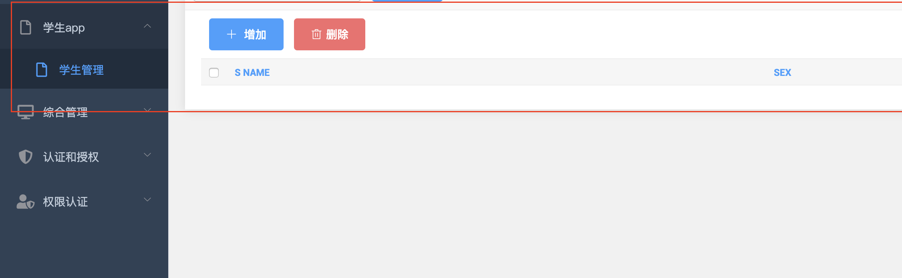

# 工程笔记

## app从创建到使用

1. 创建一个名叫student的app

```bash
python manage.py startapp student
```

2. settings.py

```python
INSTALLED_APPS = [
 'student.apps.StuentConfig',
  ...
]
```

3. 构建数据库

首先，在models.py声明一个数据库

```python

from __future__ import unicode_literals

from django.db import models

# Create your models here.
class Student(models.Model):
    s_number = models.IntegerField(primary_key=True)
    s_name = models.CharField(max_length=20)
    sex = models.CharField(max_length=2)
    subject = models.CharField(max_length=20)
    grade = models.CharField(max_length=20)
    ID_number = models.IntegerField()
    native_place = models.CharField(max_length=30)
    class Meta:
      # 数据库的中文名
      verbose_name = "学生"
      verbose_name_plural = "学生管理"
```

然后，**命令行两步**：

```bash
python manage.py makemigrations student
python manage.py migrate
```

数据库就配置好了


4. 数据库到界面的连接

apps.py可以设定app名字：

```python
class StuentConfig(AppConfig):
    name = 'student'
    verbose_name = "学生app"
```


admin.py将数据库表示到管理页面上

```python
from django.contrib import admin
from .models import Student


# Register your models here.
@admin.register(Student)
class StudentAdmin(admin.ModelAdmin):
    # 要显示的字段
    list_display = ('s_name', 'sex')

    # 需要搜索的字段
    search_fields = ('s_name',)

    # 分页显示，一页的数量
    list_per_page = 10

    actions_on_top = True

```

运行后效果如下

